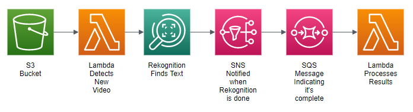

# Finding Opportunities for Overlay Ad Placements in Videos

## Purpose
This repo contains demonstration code for the "Identifying Opportunities for Placing Overlay Advertisements in Video Content" blog post published on the AWS Media & Entertainment blog, which discusses how to use Rekognition to find opportunities for overlay advertisements in video.

Overlay advertisements (also called banner advertisements) are often used during a broadcast to promote related or upcoming television shows, as well as for general third-party advertisements.  They are typically displayed in the bottom quarter of the screen (overlapping the broadcast video), and disappear after a few seconds.  Although these can be effective tools for building awareness about new shows or products, they can cause complications in cases where the banner covers up important on-screen information like subtitles, captions, or other text.

Manually finding viable times for overlay advertisements is time-consuming, but the article that accompanies this repo describes an automated method that uses AWS Rekognition, a machine learning service that works with images and videos.  Using that approach, a video can be automatically examined to find viable time slots for inserting overlay ads.

This code repo includes a CloudFormation template that is used to create the required infrastructure, and also the source code for two required lambda functions.  By deploying the infrastructure and accompanying Lambdas, you can run this solution under your own AWS account.

## Requirements

You'll need AWS SAM and the AWS CLI installed in order to deploy the pipeline.

[SAM Installation instructions](https://aws.amazon.com/serverless/sam/)

[AWS CLI Installation instructions](https://aws.amazon.com/cli/)

## Project Description

This architecture diagram shows the infrastructure needed:
<figure>

</figure>

The process is initiated by placing a video file into an S3 bucket. Once that happens, a Lambda function detects that event and initiates an AWS Rekognition job that searches for text within the video.

This operation may take several minutes to complete, so the Rekognition job signals completion by posting a notification via SNS (Simple Notification Service).

That SNS topic then adds a message to an SQS (Simple Queue Service) queue, which in turn triggers a final Lambda function that parses and processes the results and writes the result to a file stored in S3.

The resulting file indicates the time slots where an overlay ad can be placed without fear of obstructing underlying text.  The process of creating resulting output can be changed to suit your needs, so for example it could write to DynamoDB, a relational database, or it could initiate yet another Lambda function.  For this simple example, it writes the results to a text file which is stored in S3.  The name of the resulting text file is based on the original video file name, with "-results.txt" as the ending of the name.

## Installation
To deploy this code, use [SAM](https://aws.amazon.com/serverless/sam/), an extension of CloudFormation that makes it easy to deploy serverless code (such as Lambda functions.)  SAM uses the template file `cloudformation.yml`, which describes all of the required infrastructure needed, including code for the Lambda functions.

Note that before you deploy the code, you must create an S3 bucket to be used to store deployment artifacts:

```bash
# Create bucket for deployment artifacts
aws s3 mb <ARTIFACT_BUCKET>
```

The SAM commands to deploy the infrastructure are located in the `deploy.sh` file.

```bash
# Build and deploy the infrastructure stack
./deploy.sh <STACK_NAME> <ARTIFACT_BUCKET> <REGION>
```

* `STACK_NAME` is a name of your choosing that represents the full stack of resources that comprise your pipeline. Using a different `STACK_NAME` for different deployments lets you establish stacks in different environments, e.g. __development__, __staging__, __production__
* `ARTIFACT_BUCKET` is the name of an S3 bucket used during the deployment process by [CloudFormation](https://aws.amazon.com/cloudformation/).  Uses environment variable `ARTIFACT_BUCKET` as a default.
* `REGION` is the name of the desired AWS region.  Uses environment variable `AWS_DEFAULT_REGION` as a default.


## Configuring the Code
Both of the Lambda functions use environment variables for configuration data.  Although default values for the environment variables are listed in the CloudFormation template, you can override those values in the Lambda console once the Lambdas have been deployed.

The following lists out the environment variables used, with their default values:

| Lambda | Variable | Description | Default Value |
| --- | --- | --- | --- |
| RekognitionCallerLambda | SNS_TOPIC_ARN | The Arn of the SNS topic to post the Rekognition completion status to | n/a |
| RekognitionCallerLambda | IAM_ROLE_ARN | The Arn of the IAM role used by Rekognition to publish to the SNS topic when the start-text-detection operation is complete | n/a |
| RekognitionCallerLambda | TEXT_SEARCH_LEFT | From 0 to 1, the left edge of the bounding box to use for text detection  | 0.2 |
| RekognitionCallerLambda | TEXT_SEARCH_TOP | From 0 to 1, the top edge of the bounding box to use for text detection | 0.8 |
| RekognitionCallerLambda | TEXT_SEARCH_WIDTH | From 0 to 1, the width of the bounding box to use for text detection | 0.7 |
| RekognitionCallerLambda | TEXT_SEARCH_HEIGHT | From 0 to 1, the height of the bounding box to use for text detection | 0.15 |
| RekognitionCallerLambda | MIN_WORD_DETECT_CONFIDENCE | From 50 to 100, the percentage confidence required for word detection | 90 |
| ResultsProcessorLambda | MIN_AD_DURATION_IN_SECS | In seconds, the minimum amount of time needed to display an ad without covering up important text | 15 |
| ResultsProcessorLambda | MIN_WORD_WIDTH | From 0 to 1, the minimum width for a word.  Words smaller than this probably aren't meant to be read and can be safely obscured by an overlay ad | 0.05 |

## Testing the Code
You'll need a video file in order to test this code.  Supported types are `.mp4`, `.mov`, and `.avi`.  Place the video in the S3 bucket that was created during deployment to start the process.

Depending on the size of your video, Rekognition may take several minutes to finish processing.  Because of this, you may wish to add an email address as a subscriber to the SNS topic created during deployment.  That way you'll get a notification when the video processing is complete.  The results will be available shortly after that.

The results of the analysis are written into a `.txt` file which is located in the same S3 bucket as the original video.


## Cleaning up
The CloudFormation template in this repo creates resources like an S3 bucket, an SNS topic, an SQS queue, and more.  Some of those resources will incur costs, so be sure to destroy the CloudFormation stack (via the console) when you are done with it, to prevent running up unwanted costs.

## Content Security Legal Disclaimer
The sample code; software libraries; command line tools; proofs of concept; templates; or other related technology (including any of the foregoing that are provided by our personnel) is provided to you as AWS Content under the AWS Customer Agreement, or the relevant written agreement between you and AWS (whichever applies). You should not use this AWS Content in your production accounts, or on production or other critical data. You are responsible for testing, securing, and optimizing the AWS Content, such as sample code, as appropriate for production grade use based on your specific quality control practices and standards. Deploying AWS Content may incur AWS charges for creating or using AWS chargeable resources, such as running Amazon EC2 instances or using Amazon S3 storage.

## Operational Metrics Collection
This solution collects anonymous operational metrics to help AWS improve the quality and features of the solution. Data collection is subject to the AWS Privacy Policy (https://aws.amazon.com/privacy/). To opt out of this feature, simply remove the tag(s) starting with “uksb-” or “SO” from the description(s) in any CloudFormation templates or CDK TemplateOptions.
